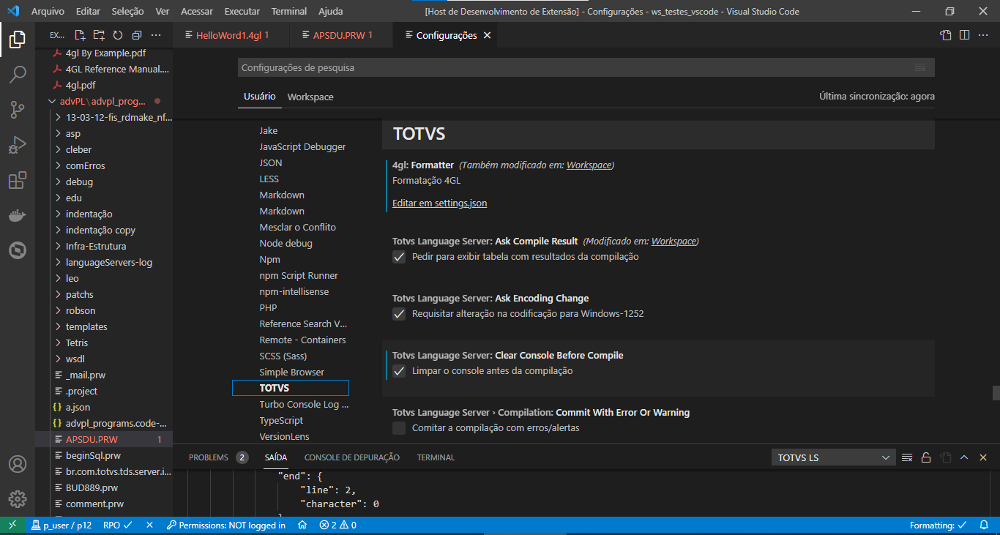

# TDS: Formatação de Código Fonte

> Requisitos
>
> - formatação ativada

## Configuração

Por padrão, a formatação de código fonte vem **desligado**. Para ligá-lo acesse `File | Preferences | Settings` e localize `4gl` ou `advpl`, conforme a linguagem de programação que deseja configurar.

Lhe será apresentado algo semelhante a:



> Saiba mais sobre precedência de configurações em [User and Workspace Settings](https://vscode.readthedocs.io/en/latest/getstarted/settings/).

O bloco `[4gl]` (ou `[advpl]`), são configurações ligadas a ativação dos processos pelo _VS-Code_ associadas ao editor da linguagem e `[4gl.formatter]` (ou `[advpl.formatter]`), são as opções de formatação específicas.

Para sobrescrever os valores padrão, acione `Edit in settings.json` ou `Add item`, informando os valores solicitados.


> Saiba mais em [Formatting](https://code.visualstudio.com/docs/editor/codebasics#_formatting) e [Indentation](https://code.visualstudio.com/docs/editor/codebasics#_indentation).

### Configurações `[4gl]` ou `[advpl]`

> A formatação para AdvPL está parcialmente implementada.

- `"files.encoding": "windows1252" | "windows1251"`

  Indica a codificação dos arquivos com código fonte. A codificação `windows1251` deve ser utilizada em fontes com _strings_ no alfabeto cirílico.

- `"editor.formatOnType": true | false`

  Habilita a formatação durante a digitação.

- `"editor.formatOnPaste": true | false`

  Habilita a formatação em blocos colados.

- `"editor.formatOnSave": true | false`

  Habilita a formatação ao salvar o arquivo.

- `"editor.formatOnSaveMode": "file" | "modifications"`

  Indica o modo de formatação ao salvar o arquivo.

- `"editor.insertSpaces": auto | false | true`

  Controla se o editor irá inserir espaços para tabulações. Se definido como `auto`, o valor será determinado com base no arquivo aberto.

- `"editor.tabSize": auto | number`

  Controla o tamanho de renderização da tabulação. Se definido como `auto`, o valor será determinado com base no arquivo aberto.

- `"files.trimTrailingWhitespace": false | true`

  Habilita a remoção de caracteres não significativos ao final da linha.

### Configurações `4gl.formatter` ou `advpl.formatter`

#### AdvPL

Não se aplica.

#### 4GL

Chaves específicas para formatação de fontes 4GL.

| Chave                                                  | Uso                                                               |
| ------------------------------------------------------ | ----------------------------------------------------------------- |
| keywordsCase <upper \| lower \| ignore>                | Coloca palavras-chaves em maiúsculas ou minúsculas. Padrão: upper |
| stringStyle <double-quotes \| single-quotes \| ignore> | Usar aspas simples ou duplas em strings. Padrão: ignore           |

### Exemplo com os valores padrão

> Arquivo `settings.json`

```JSON
{
  ...,
  "[advpl]": {
    "files.encoding": "windows1252",
    "editor.formatOnType": false,
    "editor.formatOnPaste": false,
    "editor.formatOnSave": false,
    "editor.formatOnSaveMode": "file",
    "editor.tabSize": 4,
    "editor.insertSpaces": false,
    "files.trimTrailingWhitespace": false,
  },
  "[4gl]": {
    "files.encoding": "windows1252",
    "editor.formatOnType": false,
    "editor.formatOnPaste": false,
    "editor.formatOnSave": false,
    "editor.formatOnSaveMode": "file",
    "editor.tabSize": 4,
    "editor.insertSpaces": false,
    "files.trimTrailingWhitespace": false,
  },
  "4gl.formatter": {
    "keywordsCase": "upper",
    "stringStyle": "ignore",
  }
  ...,
}
```
